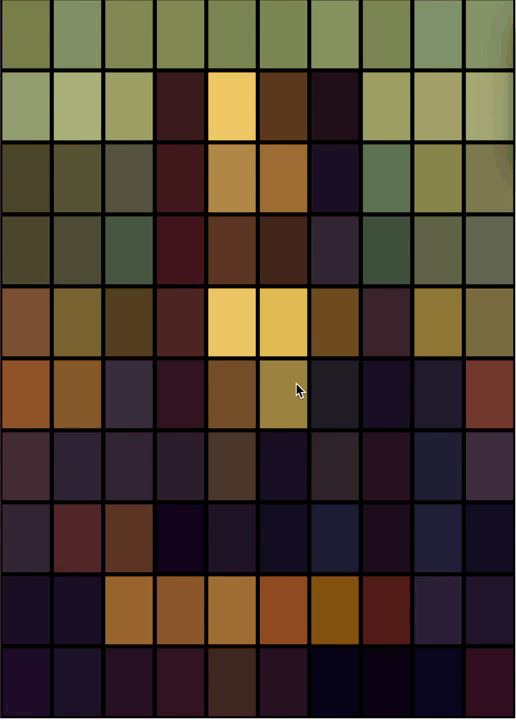

# Major_Individual

#### Xingyu Cao (xcao0633)

## Instructions on How to Interact with the Work

- **Mouse clicks:** A red stroke will appear as a ‘clickable’ indicator when the mouse hovers over a colour block, and the mouse will randomly change position and colour when clicked.

- **Resize Window:** Try resizing the browser window to see how the layout adjusts.
  

## Individual Approach to Animating the Group Code
**Animation Driver: User Input**

I chose to use User Input to drive my personal code. Combining mouse movements, clicks and releases to create animations. This choice produces varied visuals and engaging interactivity.

## Animation properties
- **Random position change:**The position of the box changes according to the mouse click.

- **Random colour change:** The colour of the box changes according to the mouse click.

- **Red Stroke on Mouse Hover:** When the mouse hovers over the colour block, the block appears with a red stroke, representing the ‘clickable’ state. This visually highlights the target and guides the user to click.

These animation features set this work apart from the work of the other panellists in that it focuses on user input and is a highly interactive feature.

## Inspiration

I was inspired by Week7's Quiz, an interactive piece of work created using User Input, which was influenced by a gif of the mouse hovering over a colour block to appear as a stroke and show the details of the image.

## Technical description
- **Mouse movement event:** Use the mouseMoved function to detect if the mouse is hovering over a graphical element and update the isMouseOver state of that element.

- **Mouse click event:** Use the mouseClicked function to detect if a mouse click occurs on a graphical element and update the isMouseClicked state of that element.
If the click was on a yellow part, the part will be randomly displaced.
If the click was on a blue or red part, the part will change colour randomly.

- **Mouse release events:**
Use the mouseReleased function to reset the isMouseClicked state of all graphical elements.